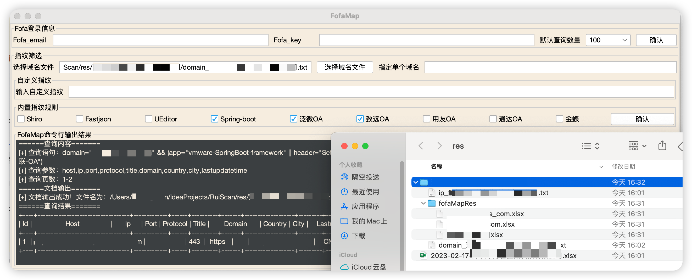

# `RuiScan`

如果本项目有帮助到你，可以点个`Star`支持作者

## 介绍

[RuiScan](https://github.com/cilan2/RuiScan) 是一款优秀的漏洞扫描工具，内部集成了`ENScan`、`OneForAll`、`JSFinder`、`cIPR`、`FofaMap`、`Xray`、`Fscan`。帮助你在HW打点的整个流程中进行高效工作。

流程介绍：

​	1.打开工具可以看到最上方的工具选择路径，首次打开均为空，必须先点击下方的工具选择按钮，选择本地的工具可执行文件的路径，选择好程序会生成一个`ruiscan.db`文件,将选择的路径保存到本地以便下次打开工具时自动载入。

​	2.工具编写之初的场景是我们只拿到了一个目标公司的名字，第一步可以将公司名称写入`ENScan`然后点击指定企业名称并点击执行`ENScan`。软件会根据企业查询软件的第一个企业名称查询相关信息，并保存在同目录下的`res`文件夹下。执行之前记得安装各个`python`程序的依赖库。

​	3.拿到`ENScan`的执行结果就可以点击导出域名导出结果中的域名和IP列表，结果会保存在`res`文件夹下的以公司名称命名的文件夹中，然后可以进一步用`OneForAll`进行更加精细化的收集。

​	4.拿到这两个文件就可以直接用`OneForAll`将`domain`文件作为输入去收集更多的资产了，可以在`OneForAll`模块的域名文件选择直接选择刚刚导出的`domian`文件，然后执行。`OneForAll`执行的过程比较慢，且由于`java`的调用机制无法获取实时回显，所以需要等待一段时间，程序结束的标志是在你的以公司名称命名的结果文件夹中生成`all_subdomian`为前缀的`txt`和`csv`文件。`JSFinder`暂时没有参与进来的原因是发包量比较大，比较容易被办，但是仍然是可以支持运行的。

​	5.`cIPR`工具可以将你的`IP`或`Domain`列表导入，它可以帮你总结出你目标所在的`IP`地址段。

​	6.然后拿到了以上的结果我们可以点击一键聚合以上结果，会将刚刚收集到的IP和`Domain`都去重并写入`ip_ domain_`开头的两个`txt`文件。

​	7.现在你可以在执行`POC`模块中选择`Fscan`或者`Xray`，然后点击一键无差别日站，如果选择`Fscan`，工具会自动对你当前任务的IP列表进行默认扫描，如果选择`Xray`，工具会对你当前任务的`Domain`列表进行默认扫描，结果同样会输出到`res`下以你当前任务公司名称命名的文件夹中，并加上`fscan_`和`xray_`的前缀来区分。

​	8.在聚合的工具框中还有一个FOFA模块，打开该模块首先需要配置好自己的email和key还有最大可以查询的数量，软件会自动替换掉fofamap配置文件中的相关设置，且将配置文件路径改为绝对路径以防止执行时读取不到配置文件而报错，因为是改写配置文件，所以只需要填写一次，后续打开工具无需重复设置，当然直接自行修改fofa.ini文件可以达到相同效果。

​	9.如果前面的工作都没有收获的话，可以使用`fofa`去查询刚刚获取到的域名文件，然后可以选择工具内置的指纹规则或者可以自定义指纹规则去对资产进行筛选，结果同样会保存在`res`中。

使用前提：
- 本地有 `JRE/JDK 8+` 环境（如果使用内置`JRE`的`exe`版本无需`Java`环境）
- 使用 `java -jar RuiScan.jar` 启动（在`Windows`中双击启动会有权限问题）
- 如果你想继续一个已存在的任务，可以在主界面的对应位置填入这个任务的公司名称，与`res`文件夹内的一致，即可继续任务

注意：
- 如果发现某个工具输出卡在`LOGO`，若该工具是`python`编写，则大概率是因为你的依赖没有完全安装
- 工具下载时请核对好自己的电脑架构去下载相应的可执行文件
